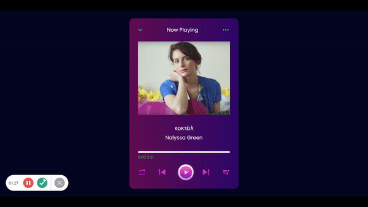

# Müzik Çalar Uygulaması
- Bu proje, HTML5, CSS3 ve JavaScript kullanılarak geliştirilen basit bir müzik çalar uygulamasıdır. Uygulama, kullanıcılara web üzerinden müzik dinleme imkanı sağlar.

## İçerik
- Müzik çalmak, duraklatmak, ileri veya geri sarmak için düğmeler bulunmaktadır.
- Müzik çaların zaman çubuğu ile çalınan müziğin ilerleyişi görsel olarak takip edilebilir.
- Kullanıcıların seçtikleri müziklerin adı, sanatçısı gibi bilgiler de görüntülenebilir.

#### Önizleme 

- Projeyi aktif olarak görmek için 
    - [Music Player ](https://sevimaydin.github.io/music-player/) sayfasını ziyaret edebilirsiniz.

      - 